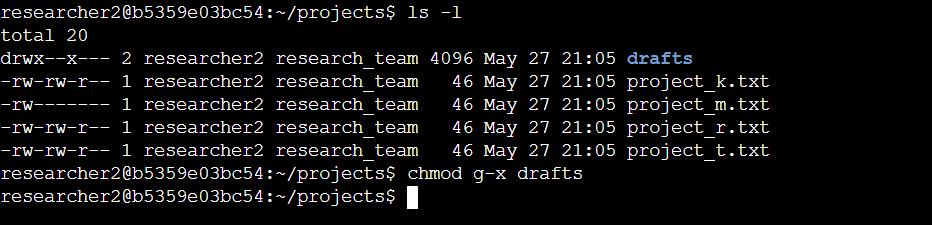
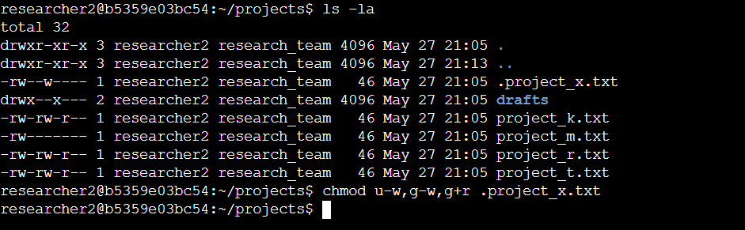
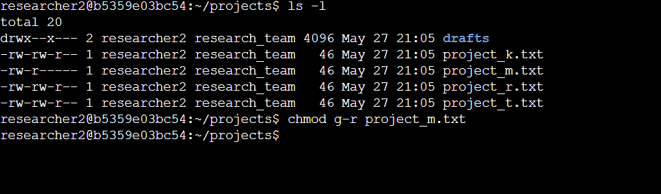
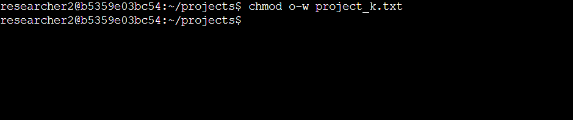
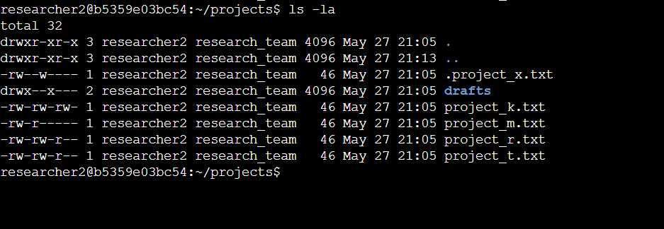
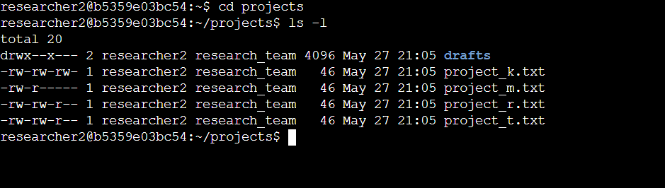

# linux-file-permissions
 Use Linux commands to manage file permissions

## Activity Overview

In this activity, you will create a new portfolio document to demonstrate your experience using Linux commands to manage file permissions. You can add this document to your cybersecurity portfolio, which you can share with prospective employers or recruiters.

## Scenario

Review the scenario below. Then, complete the step-by-step instructions.

You are a security professional at a large organization. You mainly work with their research team. Part of your job is to ensure users on this team are authorized with the appropriate permissions. This helps keep the system secure. 

Your task is to examine existing permissions on the file system. You’ll need to determine if the permissions match the authorization that should be given. If they do not match, you’ll need to modify the permissions to authorize the appropriate users and remove any unauthorized access.

Note: This scenario involves investigating and updating the same file permissions as the ones in the Manage authorization lab.  You can revisit the lab to get screenshots to include in your portfolio document. If you choose, it's also possible to complete this activity without revisiting the lab by typing your commands in the template.

# File permissions in Linux
## A. Project description

The task was to examine the existing permissions on the file system within the projects and also
determine if the permissions match the authorization that should be given to the user and if
they do not match then i should modify the permissions to authorize the appropriate users and
remove any unauthorized access

#### Check file and directory details

The following code demonstrates how I used Linux commands to determine the existing
permissions set for a specified directory in the system
1. I navigated to the project Directory
2. I then listed the contents and the permissions of the project directory
The permissions are as follows.

 

3. I then checked if there were any hidden files or folders in the directory.
The results were as follows

 

The first line of the screenshot displays the command I entered, and the other lines
display the output. The code lists all contents of the projects directory. I used the ls
command with the -la option to display a detailed listing of the contents that also
returned hidden files. The output of my command indicates that there is one directory
named drafts, one hidden file named .project_x.txt. The 10-character string in the first
column represents the permissions set on each file or directory.

## B. Describe the permissions string

The 10-character string can be deconstructed to determine who is authorized to access the
file and their specific permissions. The characters and what they represent are as follows:

● 1st character: This character is either a d or hyphen (-) and indicates the file type. If it’s
a d, it’s a directory. If it’s a hyphen (-), it’s a regular file.
● 2nd-4th characters: These characters indicate the read (r), write (w), and execute (x)
permissions for the user. When one of these characters is a hyphen (-) instead, it
indicates that this permission is not granted to the user.
● 5th-7th characters: These characters indicate the read (r), write (w), and execute (x)
permissions for the group. When one of these characters is a hyphen (-) instead, it
indicates that this permission is not granted for the group.
● 8th-10th characters: These characters indicate the read (r), write (w), and execute (x)
permissions for others. This owner type consists of all other users on the system apart
from the user and the group. When one of these characters is a hyphen (-) instead, that
indicates that this permission is not granted for others.

For example, the file permissions for project_k.txt are -rw-rw-rw-. Since the first
character is a hyphen (-), this indicates that project_t.txt is a file, not a directory. The
second, fifth, and eighth characters are all r, which indicates that user, group, and other all haveread permissions. The third, sixth and ninth characters are w, which indicates that only the user
and group have write permissions. No one has execute permissions for project_k.txt.

#### Change file permissions

The organisations determined that some should not have some file permissions to protect the
organisation so i have to change the permissions.
1. I changed the permissions of the files project_k.txt so that the owner type of other
doesn't have write permissions.

 

2. The file project_m.txt is a restricted file and should not be readable or writable by others
and only the user should have these permissions on this file.
This is how i did it

 

## C. Change file permissions on a hidden file
2. I changed the permissions of the hidden file .project_x.txt so that both the user and the group
ca read, but not write to , the file

 

## D. Change directory permissions

Only the researcher2 user should be allowed to access the drafts directory and its contents so
this means that only researcher2 should have execute privileges
1. I checked the permission of the draft directory
2. Remove the execute permission for the group from the drafts directory

 

## Summary

I changed multiple permissions to match the level of authorization my organisation wanted for
files and directories in the projects directory. The first step in this was using the la -la to check
the permissions of the directory. This informed my decision and then used the chmod command
many times to change the permissions on files and directories

